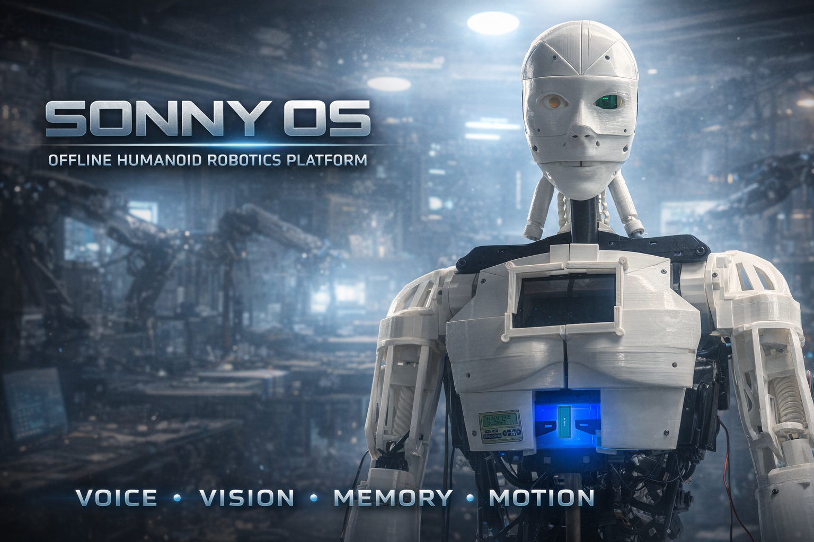
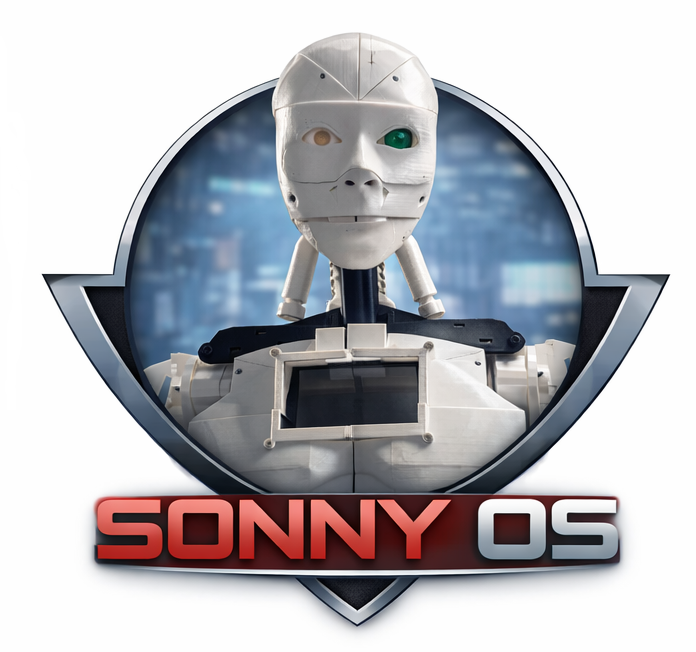
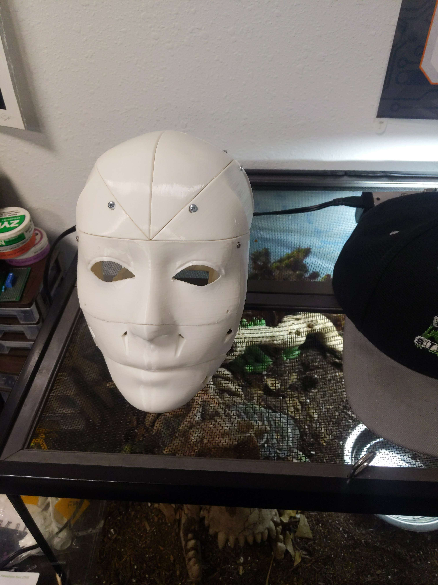
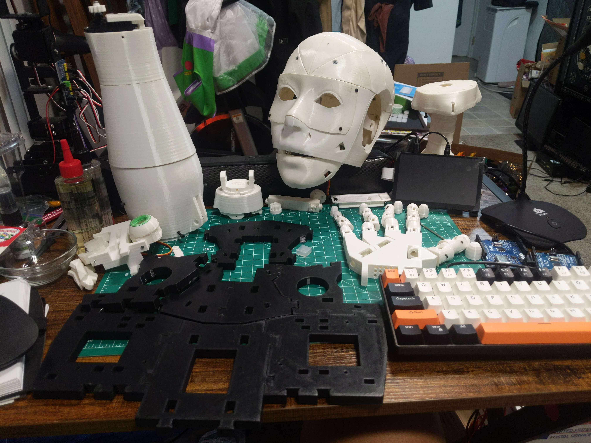
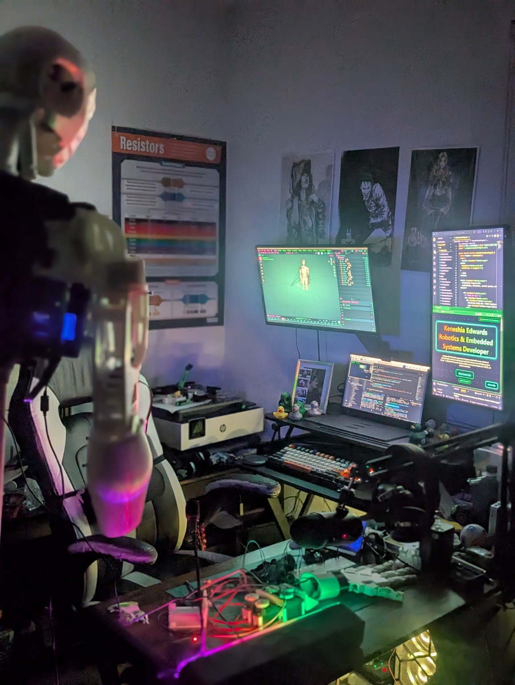
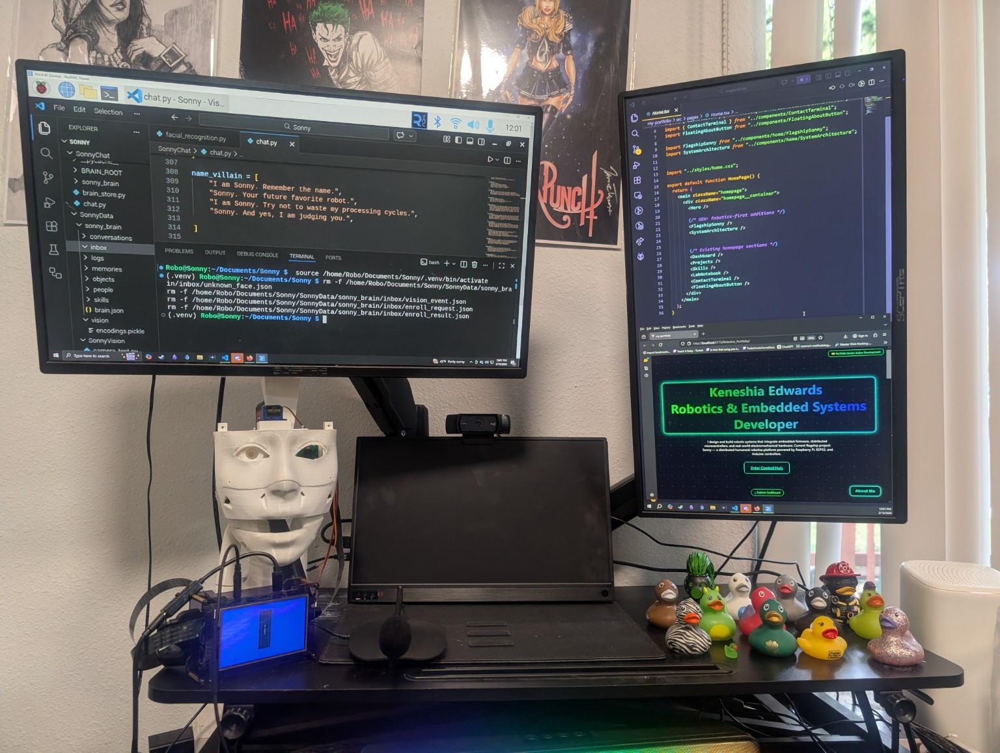
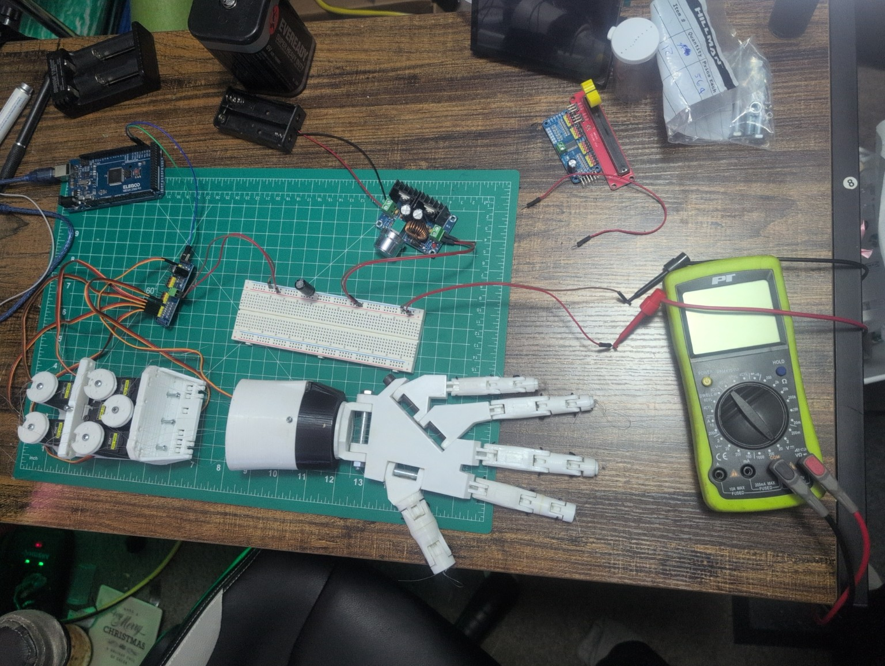
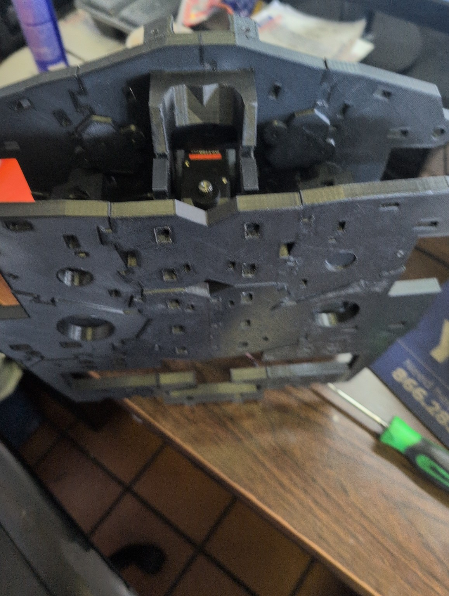
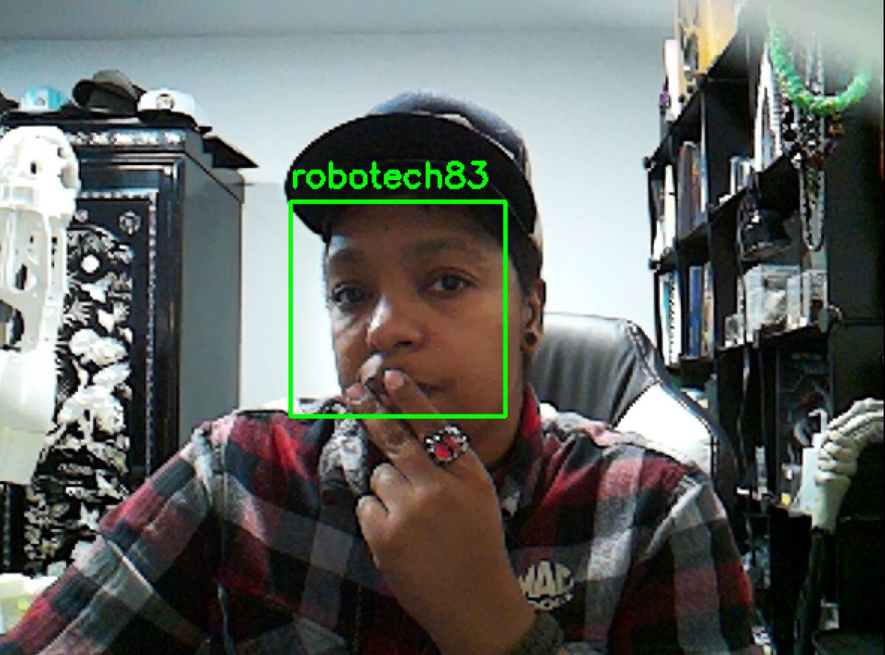

<p align="center">
  
</p>
> A fully offline humanoid robotics system built on Raspberry Pi and Arduino, combining voice, vision, memory, and motion into a modular AI-powered robot.


 ## 🌐 Portfolio

Explore the full Sonny OS project, including visuals, breakdowns, and future development:

[🚀 View Full Sonny OS Portfolio](https://robotech83.github.io/Robotics_Portfolio/)

---

## 🚀 Overview

## 🤖 Real Robot. Real System.

Sonny is not a simulation.

This is a physically built humanoid robot that:
- sees people using computer vision
- remembers them between sessions
- speaks and interacts offline
- controls real hardware through embedded systems

This project represents a full-stack robotics system:
AI + Vision + Voice + Hardware

**Sonny OS** is an offline robotics platform designed to demonstrate real-world AI integration without relying on cloud services.

The system combines:

* 🎤 Voice interaction (offline)
* 👁️ Computer vision & facial recognition
* 🧠 Persistent memory of people
* ⚙️ Hardware control via Arduino
* 🤖 Modular architecture for expansion

Sonny is actively developed as a **live demo robot** for Maker Labs and portfolio presentation, showcasing embedded systems, robotics, and AI working together in real time.

---

## 🧠 What Sonny Can Do

* Recognize faces using on-device processing
* Remember people between sessions
* Greet known users and interact with new ones
* Ask permission before storing new identities
* Speak responses using offline TTS
* Process voice commands without internet
* Control physical hardware (servos, future motion systems)

---
## 🎥 Demo & Build

### 🤖 Live Interaction (Coming Soon)
Sonny recognizing and interacting with people in real time

### 🛠️ Build Progress

<p align="center">
  
  
  
  
  
  
  
</p>

## 🏗️ System Architecture

### 🧩 Core Components

* **Sonny Core (Raspberry Pi 4)**

  * Handles vision, voice, and decision-making

* **Arduino Mega**

  * Controls servos and physical movement

* **Vision System**

  * Face detection + recognition
  * Event-driven communication with core system

* **Voice System**

  * Wake word → speech recognition → response

* **Memory System**

  * Stores known users and interaction data

---

### 📁 Project Structure (Planned / Evolving)

```
SonnyData/
│
├── vision/
│   ├── encodings.pickle
│   └── enroll_face.jpg
│
├── sonny_brain/
│   ├── inbox/
│   │   ├── vision_event.json
│   │   ├── unknown_face.json
│   │   ├── enroll_request.json
│   │   └── enroll_result.json
│   │
│   └── people/
│       └── [person].json
```

> ⚡ Sonny uses a lightweight **event-based file system** to allow subsystems to communicate without tight coupling.

---

## 🧰 Tech Stack

### 🖥️ Software

* Python
* OpenCV
* face_recognition
* Vosk (offline speech recognition)
* pyttsx3 (offline text-to-speech)
* PyAudio

### ⚙️ Hardware

* Raspberry Pi 4
* Arduino Mega 2560
* Pi Camera
* USB Microphone
* Speaker
* SG90 Servos (current)
* MG996R Servos (planned upgrades)

---

## 🎯 Project Goals

* Build a **fully offline humanoid AI system**
* Demonstrate **real-world robotics integration**
* Create a **modular robotics platform (Sonny OS)**
* Showcase skills in:

  * Embedded systems
  * Computer vision
  * AI interaction
  * Hardware control

---

## 🧪 Current Status

🟡 Active Development

### 🔧 Current Focus

* Improving facial recognition accuracy
* Fixing name parsing issues (👀 yes… *Penelope*)
* Stabilizing memory + enrollment system
* Integrating voice + vision events
* Adding servo-driven tracking (face + mouth)

---

## 🧠 Example Interaction

```
Sonny: "Hello! I don’t recognize you. Do I have your permission to remember you?"

User: "Yes"

Sonny: "Nice to meet you. I’ll remember you for next time."
```

---

## 🎥 Demo (Coming Soon)

* Maker Lab live demo footage
* Facial recognition + memory interaction
* Voice-controlled conversation
* Servo-based movement

---

## 🔮 Future Roadmap

* 🎭 Facial tracking with servo control
* 🗣️ More natural conversation flow
* 🧍 Full humanoid movement (InMoov integration)
* 🧠 Expanded memory system
* 🌐 Local dashboard for monitoring (Sonny Control Hub)
* 🎮 Demo modes (Villain Mode 😈, Demo Mode, Normal Mode)

---

## 🧑‍💻 Creator

**Robotech83**
Robotics & Embedded Systems Developer

Building real-world AI systems with a focus on:

* Offline capability
* Hardware integration
* Practical robotics

---

## 🧠 Why Sonny OS Exists

Most AI systems rely on the cloud.

Sonny is built to prove something different:

A robot that can see, think, remember, and interact — completely offline.

This project is about building real intelligence into real machines.

---

## 📌 Notes

This project is continuously evolving.
Structure, features, and architecture will improve over time as Sonny grows.

---

## 🔥 If You Like This Project

* ⭐ Star the repo
* 👀 Follow the progress
* 🤖 Watch Sonny evolve into a full humanoid system

---
